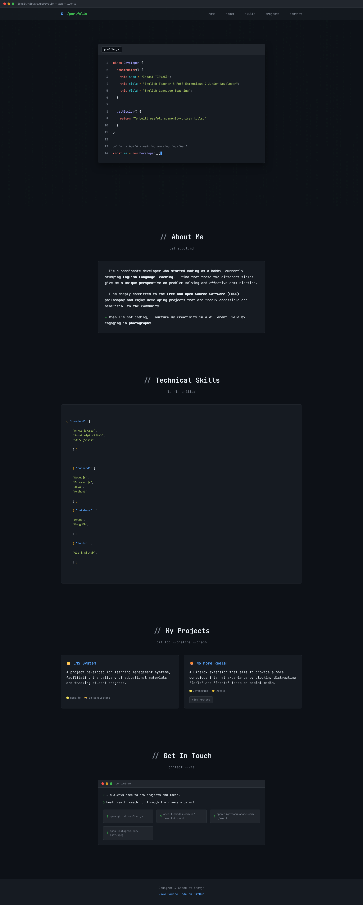

# MyPortfolio - A Terminal-Themed Developer Portfolio

A personal portfolio template designed for developers who love the command-line aesthetic. It's a single-page, fully responsive website built with vanilla HTML, CSS, and JavaScript, making it lightweight, fast, and incredibly easy to customize.

**[➡️ View Live Demo](https://isotjs.github.io/myportfolio/)**

## ✨ Features

- **Terminal Aesthetic:** A modern, code-centric design that stands out.
- **Fully Responsive:** Looks great on desktops, tablets, and mobile devices.
- **No Dependencies:** Built with pure HTML, CSS, and JavaScript. No frameworks, no libraries, no build steps required.
- **Easy to Personalize:** Designed from the ground up to be easily modified with your own information.

## 🛠️ Tech Stack

- **HTML5**
- **CSS3**
- **Vanilla JavaScript (ES6)**

## ✏️ Customization Guide

All content is located within the `index.html` file. Open it and follow the comments to add your personal touch.

1.  **`<head>` Section:**
    - Change the `<title>` to reflect your name/title.

2.  **Home Section (`#home`):**
    - Find the `class Developer` and update the `name`, `title`, and `field` with your own details.

3.  **About Me Section (`#about`):**
    - Edit the paragraphs within the `
` to tell your own story.

4.  **Skills Section (`#skills`):**
    - Modify the skills listed inside the `<pre><code>...</code></pre>` block. You can add or remove categories and items as needed.

5.  **Projects Section (`#projects`):**
    - Find the `.repo-card` divs.
    - Update the `<h3>` (project name), `
` (description), and the `<a>` tags with links to your own projects.
    - You can copy and paste a `.repo-card` block to add more projects.

6.  **Contact Section (`#contact`):**
    - Update the `<a>` tags with your email, GitHub profile, and LinkedIn profile links.

7.  **Footer:**
    - Change the name and the link to your portfolio's source code.

## 📜 License

This project is licensed under the MIT License. See the [LICENSE](LICENSE) file for details. You are free to use, modify, and distribute this template as you wish.
